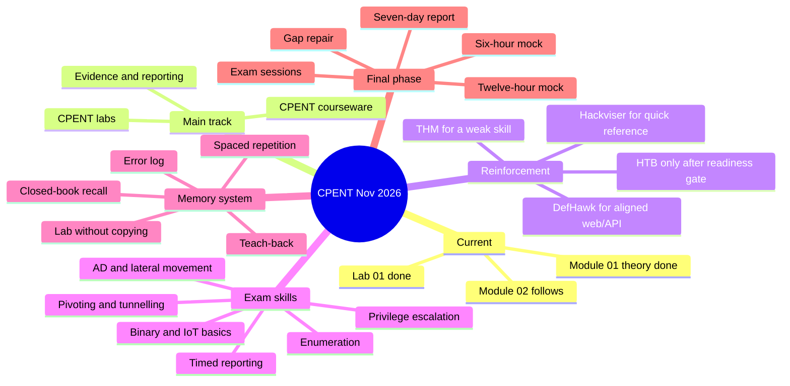

# CPENT Master Roadmap — July to November 2026

**Owner:** RedteamAI  
**Last updated:** 11 July 2026  
**Primary goal:** Complete CPENT courseware and labs, develop exam-ready practical skills, and sit the exam safely before the 15 November 2026 voucher deadline.

## 1. Current position

| Item | Status | Immediate action |
|---|---|---|
| Module 01 theory | Complete | Create a one-page recall sheet |
| Module 01 lab | **Complete — 11 July 2026** | Write the mini-report and preserve the evidence set |
| Module 02 | Started / next | Continue after the Module 01 mini-report; finish theory and lab by 19 July |
| Remaining modules | Awaiting upload | Map their real topics and workload before assigning exact dates |
| DefHawk web/API labs | Active | Use only when aligned with the current CPENT topic |
| TryHackMe | Active support | Use selected rooms for weak areas, not the whole path at once |
| Hackviser | Reference/support | Use for a specific service or weakness, not as another curriculum |
| HTB Pro Labs | Later | Start only after an AD and pivoting readiness checkpoint |
| NahamSec/HackingHub | Optional later supplement | Do not let it displace CPENT, AD, pivoting, binary, IoT, or reporting |

## 2. The decision that removes the confusion

The previous chats contained three different plans:

1. An **8-week compressed exam plan** for someone who already has strong foundations.
2. A **17–18 week CPENT course-and-lab plan** that fits the current July-to-November window.
3. An **8-month books and career curriculum** for long-term web, bug bounty, and red-team growth.

These plans should not be attempted together. Until the CPENT exam, use the 17-week CPENT plan. Keep the 8-month book curriculum for after the exam. Use the 8-week plan only as the final revision structure, not as an additional course.

## 3. Master mind map



## 4. Resource hierarchy until the exam

Use only one main source and one supporting source at a time.

| Level | Resource | How to use it |
|---|---|---|
| 1 — mandatory | CPENT courseware | Defines the week's theory and objectives |
| 1 — mandatory | CPENT labs | Proves that the theory can be applied |
| 2 — aligned practice | DefHawk / PortSwigger | One lab matching the current topic, especially web/API |
| 2 — gap repair | TryHackMe | One selected room when Linux, Windows, AD, Burp, networking, or privilege escalation is weak |
| 3 — quick lookup | Hackviser | Look up one tool, protocol, or service while practising |
| 4 — later range | HTB Pro Labs | Use after AD, privilege escalation, tunnelling, and pivoting can be performed without step-by-step help |
| 4 — optional web depth | NahamSec/HackingHub | Use after CPENT weekly work is complete, or after the CPENT exam |
| Paused | Large book list | Reference only; do not read several books cover to cover before the exam |

### Weekly time allocation (about 14 hours)

| Work | Hours | Rule |
|---|---:|---|
| CPENT theory and official labs | 9 | Always completed first |
| One aligned support activity | 3 | Choose DefHawk, THM, Hackviser, or later HTB — not all |
| Recall, evidence cleanup, and report writing | 2 | Never skip |

## 5. Current CPENT blueprint priorities

The current official blueprint is broad, so web exploitation alone is not enough.

| Domain | Weight | Personal emphasis |
|---|---:|---|
| Web Application and API Penetration Testing | 14% | Maintain existing strength; focus on authorization, API, JWT, business logic, and reporting |
| Methodology, Scoping, and Engagement | 13% | Learn scope, ROE, evidence standards, and repeatable workflow |
| Information Gathering and Attack Surface Mapping | 13% | Build a disciplined recon and target-tracking process |
| Endpoint Exploitation, Privilege Escalation, and Lateral Movement | 13% | **High improvement priority:** Windows, Linux, AD, lateral movement, pivoting |
| Reporting and Post-Testing Actions | 13% | **High improvement priority:** write during every lab |
| Perimeter Defense Evasion | 12% | Practise firewall/IDS-aware testing and network paths in legal labs |
| Reverse Engineering and Binary Exploitation | 11% | Build fundamentals; do not postpone until the last week |
| IoT Penetration Testing | 11% | Build a compact concepts, firmware, protocol, and reporting sheet |

## 6. Date-based roadmap

This is the default cadence. Exact module-to-week mapping will be corrected after the remaining module files are uploaded because modules are unlikely to be equal in size.

### Immediate weekend: 11–12 July

**Saturday, 11 July**

- [x] Complete Lab 01 before adding another course.
- [x] Save every important command/request, output, screenshot, mistake, and fix.
- If stuck for 25 minutes, request a Level 1 hint rather than a full solution.

**Sunday, 12 July**

- Write the Lab 01 mini-report.
- Explain Module 01 aloud for five minutes without notes.
- Answer ten closed-book questions.
- Begin Module 02 for 30–60 minutes only after the report is complete.

### Courseware phase: 13 July–4 October

| Dates | Default target | Checkpoint |
|---|---|---|
| 13–19 July | Module 02 + its lab | Complete from memory and produce one-page sheet |
| 20 July–16 August | Next four modules/labs | First monthly test; identify three weakest skills |
| 17 August–13 September | Next four modules/labs | AD, privilege escalation, and pivoting checkpoint |
| 14 September–4 October | Remaining modules/labs | Complete courseware; one lighter week may contain two small modules |

### Exam-readiness phase: 5 October–1 November

| Dates | Focus | Required output |
|---|---|---|
| 5–11 October | Repair the three weakest domains | Repeat labs without walkthroughs; update cheat sheets |
| 12–18 October | Six-hour mini mock | Target map, command log, evidence set, and mini report |
| 19–25 October | Twelve-hour full mock | Full attack chain and professional report draft |
| 26–30 October | Final review and tool freeze | Tested environment, first-90-minute checklist, final-60-minute checklist |
| 31 October–1 November | Safe target for two 12-hour exam sessions | Complete final exam session by 1 November if dashboard availability permits |
| 2–8 November | Report production and QA | Submit by 8 November, leaving buffer before 15 November |

Confirm the exact activation, scheduling, and voucher rules shown in the EC-Council dashboard before booking. The safe date above intentionally leaves time for the required report and unexpected problems.

## 7. Weekly operating system

| Day | Main activity |
|---|---|
| Monday | Learn the week's CPENT concepts; create questions while reading |
| Tuesday | Finish theory; practise commands and explain why each is used |
| Wednesday | Start the official lab; record evidence as work happens |
| Thursday | Finish the official lab; repeat the hardest step without notes |
| Friday | 30–45 minute recall session or rest; no new course |
| Saturday | Long practical block; one aligned DefHawk/THM task only if CPENT work is on schedule |
| Sunday | Mini-report, closed-book quiz, error-log review, and next-week planning |

### Minimum viable week

When work or life becomes busy, complete these three things:

1. One CPENT learning block.
2. One official practical lab block.
3. One recall/report block.

Do not compensate by opening several new platforms.

## 8. The learning cycle for every module

Use this cycle instead of repeatedly reading notes:

1. **Preview (10 minutes):** headings, objectives, tools, and expected outcomes.
2. **Learn (45–90 minutes):** understand the concept and write questions, not copied paragraphs.
3. **Recall (10 minutes):** close the material and reconstruct the workflow.
4. **Lab (90–180 minutes):** attempt independently; record commands, evidence, and decisions.
5. **Explain (5 minutes):** teach the attack and defence in simple words.
6. **Report (20–40 minutes):** write objective, steps, evidence, impact, and remediation.
7. **Re-test:** repeat the difficult part without notes after seven days.

### Spaced-review schedule

Review each module on:

- Day 0: after learning
- Day 1: ten-minute recall
- Day 3: questions and commands
- Day 7: repeat the difficult lab step
- Day 14: mixed quiz
- Day 30: attack-chain reconstruction

## 9. Notes that are designed to be remembered

Create only these files for each module:

```text
Module-XX/
├── 01-One-Page-Map.md
├── 02-Commands-and-Why.md
├── 03-Lab-Evidence.md
├── 04-Errors-and-Fixes.md
├── 05-Quiz.md
└── 06-Mini-Report.md
```

### One-page map template

```text
Topic:
Purpose:
When used in a pentest:
Inputs required:
Five-step workflow:
Important commands/requests:
Expected output:
Common failure and fix:
Evidence to capture:
Defensive remediation:
```

### Lab evidence template

```text
Date and lab:
Objective:
Target/asset:
Starting access:
Hypothesis:
Command or HTTP request:
Important output:
Screenshot filename:
Why the step worked:
Next decision:
Mistake and correction:
Final proof:
```

### Mini-report template

```text
Title:
Affected asset:
Summary:
Steps to reproduce:
Evidence:
Root cause:
Impact:
Severity and justification:
Remediation:
References:
```

## 10. Hint system for labs

To build independent problem-solving, use progressive hints:

- **Level 1 — Concept:** identify the class of weakness or next phase.
- **Level 2 — Direction:** identify the relevant endpoint, service, tool, or parameter.
- **Level 3 — Execution:** provide a command/request structure with placeholders.
- **Full walkthrough:** only after an honest attempt and review of what failed.

## 11. Readiness gates

### Before starting an HTB Pro Lab

All of these should be true:

- Enumerate a Windows and Linux target systematically.
- Perform basic Linux and Windows privilege escalation with limited notes.
- Explain Kerberos and common AD enumeration steps.
- Create and verify a tunnel or SOCKS route in a legal lab.
- Reach a second network through a pivot and prove connectivity.
- Maintain a usable evidence and command log for four hours.

### Before booking the CPENT exam

- All official modules and required labs completed.
- Three weakest domains repeated.
- One six-hour and one twelve-hour mock completed.
- Report template tested during both mocks.
- Evidence can be traced from finding to screenshot and command.
- First-90-minute and final-60-minute procedures rehearsed.
- Exam environment and permitted references confirmed.

## 12. Mentor workflow when new modules are uploaded

For each uploaded module, the mentor will produce:

1. A simple topic map and prerequisite check.
2. A concise explanation of each important concept.
3. Commands/requests with purpose and expected output.
4. A safe lab checklist.
5. Progressive hints, not an immediate answer dump.
6. Ten recall questions and a short practical test.
7. A one-page revision sheet.
8. A post-lab analysis based on evidence and errors.
9. An update to this master tracker and the exam-readiness gaps.

The learner will first attempt the lab, record where they became stuck, and then request the smallest useful hint.

## 13. Official references and supporting resources

- [Official EC-Council CPENT page](https://www.eccouncil.org/train-certify/certified-penetration-testing-professional-cpent/)
- [Current CPENT v2 exam blueprint](https://cert.eccouncil.org/images/doc/CPENTv2-Exam-Blueprint.pdf)
- [TryHackMe Jr Penetration Tester path](https://tryhackme.com/path/outline/jrpenetrationtester)
- [Hackviser](https://hackviser.com/)
- [NahamSec Hands-On Web Exploitation course](https://app.hackinghub.io/course/nahamsec-bug-bounty-course/purchase?v=nahamsecdotcom&_trk=d5bbc80cb41720ccca15f506dcecf209)

## 14. Next checkpoint

**By Sunday evening, 12 July 2026:**

- [x] Lab 01 completed on 11 July 2026.
- Lab 01 mini-report completed.
- Module 01 one-page map created.
- Ten Module 01 recall questions answered.
- Module 02 opened only after those items are done.

The next roadmap revision should occur after Module 01 Lab evidence and Module 02 files are uploaded.
