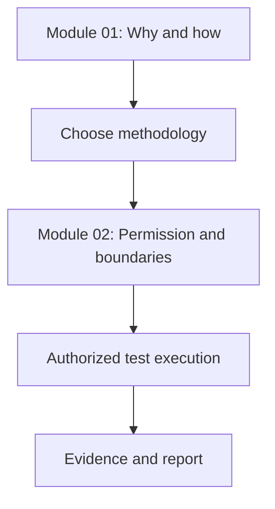
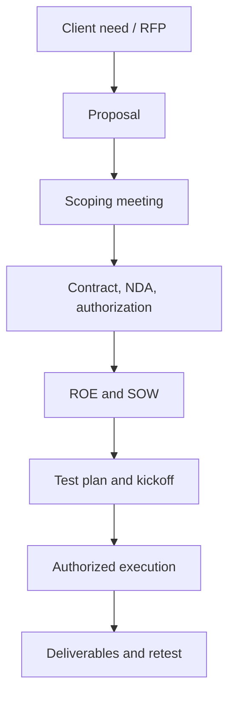

# CPENT Modules 01–02 — Teacher Guide

**Student:** RedteamAI  
**Prepared:** 10 July 2026  
**Purpose:** Convert the supplied CPENT screenshots into an active-learning course with practical exercises, recall tests, and reusable engagement templates.

## Source assessment

| Module | Source material | Recovery status | Limitation |
|---|---|---|---|
| Module 01 — Introduction to Penetration Testing and Methodologies | 73 screenshots, recovered notes, cram sheet | Complete and well structured | No separately labelled official lab guide was found |
| Module 02 — Penetration Testing Scoping and Engagement | 105 screenshots covering course pages 79–190 | OCR completed and key pages visually validated | No separate text notes or separately labelled official lab guide was found |

This guide is a concise teaching synthesis. It does not reproduce the courseware page by page.

## How the two modules fit together



- **Module 01** explains what penetration testing is, why it is performed, the major methodologies, the attack lifecycle, ethics, AI, and compliance.
- **Module 02** converts that theory into a legally authorized and operationally controlled engagement.
- A technically successful exploit outside the agreed scope is still a professional failure and may be unlawful.

---

# Module 01 — Introduction to Penetration Testing and Methodologies

## Learning objectives

1. Explain penetration testing and distinguish it from an audit and vulnerability assessment.
2. Select an appropriate penetration-test type and methodology.
3. Explain the characteristics, ethics, and responsibilities of a professional tester.
4. Describe appropriate uses and limitations of AI-assisted penetration testing.
5. Connect penetration testing to compliance requirements.

## The core definition

A penetration test is an **authorized, goal-oriented simulation of an adversary** used to evaluate whether security controls can be defeated and what business impact could result.

### Audit vs vulnerability assessment vs penetration test

| Activity | Primary question | Typical result |
|---|---|---|
| Security audit | Are policies, standards, and controls being followed? | Compliance gaps and control observations |
| Vulnerability assessment | What weaknesses probably exist? | Prioritized vulnerability list |
| Penetration test | Can weaknesses be exploited or chained to achieve an objective? | Proven attack paths, evidence, impact, and remediation |

### Three assessment orientations

| Orientation | Main goal | Example |
|---|---|---|
| Goal-oriented | Prove or disprove a defined security objective | Determine whether payment data can be reached from the internet |
| Compliance-oriented | Evaluate required controls against a standard | PCI DSS penetration testing |
| Red-team-oriented | Test prevention, detection, and response against realistic adversary behaviour | Simulated multi-stage intrusion with agreed objectives |

## Three broad phases

| Phase | Key activities |
|---|---|
| Pre-attack | Authorization, scope, information gathering, active/passive reconnaissance, scanning, planning |
| Attack | Initial access, exploitation, privilege escalation, lateral movement, persistence when permitted, objective completion |
| Post-attack | Evidence preservation, cleanup/restoration, result validation, reporting, remediation and retesting |

## Methodology map

| Methodology/framework | Best remembered for |
|---|---|
| OWASP WSTG | Structured web-application testing |
| OSSTMM | Operational security testing and measurable security |
| NIST SP 800-115 | Technical testing and assessment guidance |
| PTES | End-to-end penetration-test execution standard |
| ISSAF | Structured information-systems security assessment |
| MITRE ATT&CK | Adversary tactics and techniques based on observed behaviour |
| STRIDE | Threat categories: spoofing, tampering, repudiation, information disclosure, denial of service, elevation of privilege |
| DREAD | Historical risk-rating model |
| OCTAVE | Organization-focused risk assessment |
| VAST | Scalable application and operational threat modelling |

## EC-Council/LPT lifecycle

Learn the logic before memorizing the sequence:

1. Planning and scoping
2. Reconnaissance and information gathering
3. Vulnerability assessment
4. Gaining access
5. Privilege escalation
6. Lateral movement
7. Maintaining access, when authorized
8. Data exfiltration simulation, when authorized
9. Clearing test artifacts or restoring changes
10. Documentation and reporting
11. Remediation testing

## MITRE ATT&CK enterprise tactics

Group them into four memory blocks:

- **Prepare:** Reconnaissance, Resource Development
- **Enter and run:** Initial Access, Execution, Persistence
- **Expand control:** Privilege Escalation, Defense Evasion, Credential Access, Discovery, Lateral Movement
- **Achieve objective:** Collection, Command and Control, Exfiltration, Impact

## Professional and legal principles

- Written authorization, scope, timing, and approved techniques are mandatory.
- A tester must understand business impact, not merely operate tools.
- Technical, organizational, and legal risks must be considered.
- Destructive activity such as denial-of-service testing requires explicit approval and safeguards.
- Evidence and reports must protect client confidentiality.

## AI-assisted penetration testing

AI can help with reconnaissance organization, log analysis, payload explanation, code review, reporting, and repetitive workflow automation. It does not replace authorization, human validation, or professional judgment.

Important risks:

- Hallucinated vulnerabilities or commands
- False positives and missed context
- Disclosure of client data to an unapproved service
- Automation causing unintended impact
- Inability to explain or reproduce an AI-generated result

## Compliance associations

| Requirement | Main association |
|---|---|
| PCI DSS | Payment-card data |
| HIPAA | US healthcare information |
| GDPR | Personal data and privacy in the EU/EEA context |
| SOX | Controls affecting financial reporting |
| FedRAMP | US federal cloud services |
| NIST SP 800-53 | Security and privacy controls |
| SOC 2 | Service-organization trust services criteria |
| FINRA | US securities-industry requirements |
| ISO/IEC 27001 | Information security management systems |

## Module 01 practical exercises

### Exercise 1 — Classify the assessment

For each scenario, choose audit, vulnerability assessment, penetration test, or red-team exercise and justify the answer.

1. A scanner identifies missing patches on 600 endpoints.
2. A consultant checks whether documented access-control policies satisfy an internal standard.
3. A team proves that a low-privileged account can reach a restricted finance database.
4. An organization tests whether its SOC detects and contains a realistic multi-stage intrusion.

### Exercise 2 — Map an attack chain

Map this fictional legal-lab chain to both the LPT lifecycle and MITRE ATT&CK:

```text
Discover public employee format
→ obtain a test account
→ exploit a vulnerable lab application
→ recover a service credential
→ enumerate the lab domain
→ move to a second lab host
→ collect a dummy flag
→ document and clean up
```

### Exercise 3 — Explain it aloud

Give a five-minute explanation answering:

1. Why is a vulnerability scan not a penetration test?
2. Why can a successful technical result still be a failed engagement?
3. When would OWASP, NIST SP 800-115, PTES, and MITRE ATT&CK each help?

---

# Module 02 — Penetration Testing Scoping and Engagement

## Learning objectives

1. Understand the elements required to respond to a penetration-testing RFP.
2. Draft effective Rules of Engagement.
3. Explain critical legal and regulatory considerations.
4. Identify resources and tools needed for a successful test.
5. Manage scope creep correctly.

## The engagement lifecycle



## RFP and proposal process

### RFP asks vendors to propose

The client communicates the business need, target environment, expected services, constraints, evaluation criteria, submission instructions, and required deliverables.

### A strong proposal answers

- Who the vendor is and why it is qualified
- The understood objectives and scope
- Proposed approach and methodology
- Assumptions, dependencies, and exclusions
- Deliverables and report formats
- Project schedule and milestones
- Staffing and required specialist roles
- Itemized pricing
- References and relevant experience
- Terms, validity period, and acceptance method

### Scoping questions

Ask for measurable quantities and boundaries:

- Domains, applications, APIs, IP ranges, subnets, cloud accounts, physical sites
- Number and type of servers, workstations, network devices, wireless networks and databases
- Test type: black, grey, or white box
- Internal, external, web, API, mobile, wireless, cloud, social-engineering or physical testing
- Production, staging, or cloned environment
- Allowed and prohibited techniques
- Testing windows and blackout periods
- Third-party systems and required third-party authorization
- Data classifications and evidence restrictions
- Deliverables, severity model, retest, and acceptance criteria

## Essential document matrix

| Document | Who typically initiates it | Main purpose | Memory hook |
|---|---|---|---|
| RFP | Client | Requests competing solutions and prices | “What can you offer?” |
| Proposal | Testing provider | Explains solution, method, schedule, staff, deliverables, and price | “This is how we will help” |
| Contract/MSA | Both parties with legal review | Establishes commercial and legal relationship, warranties, liability and dispute terms | “Legal relationship” |
| NDA | Both parties | Protects confidential information | “Do not disclose” |
| Authorization/engagement letter | Client | Provides explicit permission to perform the test | “You may test” |
| ROE | Client and test team | Defines operating rules, communication, safety, evidence and stop conditions | “How we behave” |
| SOW | Provider and client | Defines the exact work, objectives, period, deliverables, acceptance and pricing | “What work will be done” |
| Test plan | Test team, approved by client | Converts scope and ROE into tasks, methods, resources and schedule | “How we execute” |
| Engagement log | Test team | Records important engagement events, decisions, changes and communications | “What happened” |
| DUA | Relevant regulated-data parties | Governs permitted use and disclosure of defined data | “How data may be used” |
| Change request | Client/provider | Formally alters scope, time, cost, resources, risk or deliverables | “Controlled scope change” |

## Rules of Engagement

The ROE must be signed and must be specific enough to guide a tester during uncertainty.

### Minimum ROE contents

1. **Communication:** primary and emergency contacts, secure communication channel, status cadence and escalation path.
2. **Timeline:** start/end dates, milestones, testing windows and blackout periods.
3. **Locations:** remote/on-site requirements and authorized source addresses.
4. **Meetings:** kickoff, status, emergency and closeout meetings.
5. **Evidence handling:** classification, encryption, access, transfer, retention, destruction, hashing and chain of custody.
6. **Personnel:** test-team members and client staff available for assistance.
7. **Targets:** exact in-scope assets and unambiguous exclusions.
8. **Techniques:** permitted and prohibited methods, including DoS, phishing, physical access, persistence and data-exfiltration simulation.
9. **Safety:** stop conditions, incident handling, backup/restore responsibilities and production safeguards.
10. **Reporting:** urgent-finding notification, regular status, report format, recipients and retesting.

## Legal and regulatory control points

- Obtain written permission from the actual asset owner.
- Identify hosting providers, cloud providers, ISPs, business partners and other third parties whose systems may be affected.
- Have contracts, the engagement letter and specialist clauses reviewed by qualified legal counsel.
- Define ownership and permitted use of data, tools, evidence, reports and intellectual property.
- Define liability caps, indemnification, warranties, dispute resolution and insurance requirements.
- Define confidentiality, retention, secure destruction and breach-notification duties.
- Treat any activity outside authorization as prohibited even if it appears technically harmless.
- Local law varies; course examples such as the US Computer Fraud and Abuse Act are not substitutes for engagement-specific legal advice.

## Evidence handling

- Assign an evidence identifier.
- Record collector, time, source and method.
- Hash evidence when integrity must be demonstrated.
- Preserve originals and analyse copies where appropriate.
- Encrypt evidence at rest and in transit.
- Restrict access to named individuals.
- Maintain chain-of-custody records.
- Follow agreed retention and destruction periods.

## Resources and operational preparation

Before execution:

- Review the signed engagement letter and create a secure engagement workspace.
- Create an engagement log.
- Hold a kickoff meeting with sponsor, project managers, technical owners and relevant legal/risk contacts.
- Finalize the SOW, ROE and test plan.
- Select tools according to objectives rather than habit.
- Prepare isolated/tested hardware, software, VPN, storage and secure communications.
- Decide note-taking, screenshot and recording tools approved for client data.
- Request relevant previous assessment reports and internal-control questionnaires.
- Confirm the provided-by-client list and all dependencies.
- Obtain final signatures and any stakeholder, provider or law-enforcement coordination genuinely required by the engagement.
- Brief the team immediately before testing.

## Scope creep

Scope creep is an unapproved expansion of objectives, assets, techniques, time or deliverables after the engagement was defined.

### Correct response

1. Stop and clarify the requested change.
2. Assess legal authority, risk, time, staffing, cost and deliverables.
3. Document the change.
4. Obtain approval and updated authorization before testing the new item.
5. Update the SOW, ROE, test plan and schedule as required.
6. Politely refuse if the change is not approved.

Extra payment alone is not authorization. A verbal request from a technical employee does not automatically expand the signed scope.

## Module 02 practical engagement lab

Use a fictional company or a legal training environment only.

### Scenario

Northstar Payments asks for a grey-box assessment of its staging web application and API. Production, employee phishing, physical entry, denial-of-service, persistence and access to real customer data are prohibited. Testing is allowed Saturday 20:00–02:00 UK time. Critical findings must be reported immediately. Deliverables are an executive summary, technical report and one retest.

### Student deliverables

1. **One-page proposal outline**
2. **Scope table** listing included and excluded assets
3. **ROE** with communication, timing, techniques, evidence and stop conditions
4. **SOW outline** with objectives, work, period, deliverables, pricing assumptions and acceptance criteria
5. **Test plan** with phases, tasks, tools, dependencies and evidence naming
6. **Scope-change response** for this event: the client asks during testing to scan a production IP not listed in scope

## Reusable scope table

| Asset/Activity | In scope? | Exact identifier | Permitted depth | Window | Owner/authorization | Notes |
|---|---|---|---|---|---|---|
| Staging web app | Yes | `staging.example.invalid` | Non-destructive web testing | Sat 20:00–02:00 | Named owner | Dummy data only |
| Staging API | Yes | `api-staging.example.invalid` | AuthN/AuthZ and input testing | Sat 20:00–02:00 | Named owner | Rate limit agreed |
| Production | No | All production assets | None | N/A | N/A | Stop if encountered |

## Scope-change record

```text
Change ID:
Requested by:
Date/time:
Requested change:
Reason:
Assets/techniques affected:
Authorization/ownership check:
New risks:
Time and cost impact:
Deliverable impact:
Required document updates:
Approved by client:
Approved by provider:
Effective date/time:
```

---

# Seven-day teaching plan

| Day | Lesson | Required output |
|---|---|---|
| 1 | Module 01 concepts and assessment types | Closed-book comparison table |
| 2 | Methodologies, LPT lifecycle and MITRE ATT&CK | Attack-chain mapping |
| 3 | Ethics, AI and compliance | Five-minute teach-back and Module 01 quiz |
| 4 | RFP, proposal and scoping | Proposal outline and scope questionnaire |
| 5 | ROE, authorization and evidence | One-page ROE |
| 6 | Contract documents, SOW, test plan and resources | Document-purpose matrix from memory |
| 7 | Scope creep and practical engagement | Complete Northstar engagement pack and oral review |

## Spaced review

- Same day: explain the lesson without notes.
- Next day: answer five recall questions.
- Day 3: reconstruct the main workflow.
- Day 7: repeat the practical exercise without copying.
- Day 14: mixed Module 01/02 quiz.
- Day 30: build a complete engagement map from a new scenario.

---

# Diagnostic quiz

Answer without notes.

1. What additional evidence does a penetration test provide beyond a vulnerability assessment?
2. What separates an authorized tester from an attacker from a legal and professional perspective?
3. Place privilege escalation, lateral movement, and reporting in the LPT lifecycle.
4. What is MITRE ATT&CK used for?
5. What are the five Module 02 learning objectives?
6. Who normally issues an RFP, and who submits a proposal?
7. Explain the difference between an ROE and SOW.
8. Name six items that must be unambiguous in the scope.
9. What should happen if a tester discovers that an in-scope hostname resolves to a third-party IP?
10. Why is a client employee's verbal request insufficient to expand scope?
11. Name five minimum ROE sections.
12. What is an engagement letter primarily intended to prove?
13. How do an NDA and DUA differ?
14. Why should evidence be hashed and chain of custody maintained?
15. Describe the correct process for approving a new production target during an engagement.

## Readiness standard

The student is ready to progress when they can:

- Score at least 12/15 on the diagnostic quiz.
- Explain the document matrix without prompts.
- Produce a scope table and ROE that another tester could follow.
- Recognize an unauthorized request and stop correctly.
- Complete the fictional engagement pack with no ambiguous target boundaries.

## Source links

- [CPENT Notes folder](https://drive.google.com/drive/folders/1uh76Ffvc3FvFR_zO7hn6n3rLaH1OZR7u)
- [Module 01 recovered notes](https://drive.google.com/file/d/1RWVvAT964Fn5HIdooKsGZdnI0w6sBU5V/view?usp=drivesdk)
- [Module 01 cram sheet](https://drive.google.com/file/d/1jm8qbDzU1SyhkYsdH0B1mTxOQftaEaMa/view?usp=drivesdk)
- [Module 01 screenshot folder](https://drive.google.com/drive/folders/1QurVDolwmHFtaCaVFMWds2SBYmn0LyUE)
- [Module 02 screenshot folder](https://drive.google.com/drive/folders/1oHAyeg_F714CE6E1-VdCs6MQoyVqbW_T)
